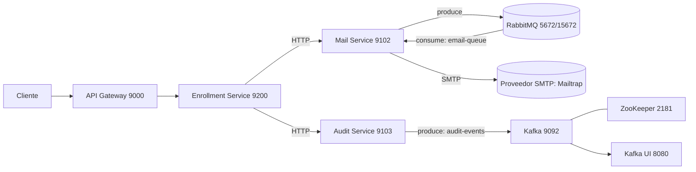

# Aplicación de Microservicios: Arquitectura y Despliegue

Este repositorio contiene varios microservicios y componentes de infraestructura orquestados con Docker Compose.

## Arquitectura



- `api-gateway` expone el punto de entrada y enruta hacia `enrollment-service`.
- `enrollment-service` invoca por HTTP a `mail-service` y `audit-service`.
- `mail-service` publica notificaciones en RabbitMQ y (por diseño) consume la cola `email-queue` para enviar correos vía SMTP. `user-service` puede opcionalmente consumir la misma cola si se desea.
- `audit-service` publica eventos en el tópico Kafka `audit-events`; `Kafka UI` permite visualización y administración.
- `auth-service` usa PostgreSQL para su persistencia.

## Puertos y URLs

- `api-gateway`: `http://localhost:9000`
- `enrollment-service`: `http://localhost:9200`
- `mail-service`: `http://localhost:9102`
- `audit-service`: `http://localhost:9103`
- `auth-service`: `http://localhost:9101`
- `RabbitMQ UI`: `http://localhost:15672` (usuario `guest`, contraseña `guest`)
- `Kafka UI`: `http://localhost:8080`
- `PostgreSQL`: `localhost:5432`

## Despliegue Rápido

Requisitos:
- Docker Desktop y Docker Compose instalados.
- Puertos anteriores libres.

Pasos:
1. Ubícate en la carpeta raíz del proyecto (por ejemplo `d:\docker\proy17`).
2. (Opcional pero recomendado) Crea un archivo `.env` en la raíz con las credenciales SMTP:
   ```env
   MAIL_HOST=sandbox.smtp.mailtrap.io
   MAIL_PORT=2525
   MAIL_USERNAME=<tu_usuario_mailtrap>
   MAIL_PASSWORD=<tu_password_mailtrap>
   ```
3. Levanta toda la pila:
   ```bash
   docker compose up -d
   ```
4. Verifica estado de contenedores y healthchecks:
   ```bash
   docker compose ps
   ```
5. Accede a `Kafka UI` en `http://localhost:8080` y a `RabbitMQ UI` en `http://localhost:15672`.

## Pruebas Rápidas (Smoke Tests)

- Enviar email de prueba (Mail Service):
  ```bash
  curl -X POST http://localhost:9102/email/send \
    -H "Content-Type: application/json" \
    -d '{"to":"test@mailtrap.test","subject":"Health Check","body":"System smoke test"}'
  ```
  Luego revisa logs del `mail-service`:
  ```bash
  docker compose logs -n 120 mail-service
  ```
  Deberías ver líneas como: `SMTP email sent to: test@mailtrap.test`.

- Ver tópicos en Kafka (desde el contenedor):
  ```bash
  docker exec kafka bash -lc "kafka-topics --bootstrap-server kafka:9092 --list"
  ```
  Deberías ver: `audit-events`, `email-notifications`.

## Configuración Clave

- RabbitMQ
  - Cola por defecto: `email-queue`
  - Exchange: `user-exchange`
  - Routing key: `email.notification`
  - UI: `http://localhost:15672` (`guest/guest`)

- Kafka
  - Broker: `kafka:9092` (interno), `localhost:29092` (host)
  - Tópicos: `audit-events`, `email-notifications`
  - UI: `http://localhost:8080`

- SMTP (Mailtrap)
  - Variables usadas por `mail-service` se leen como `MAIL_*` desde `.env` mediante `application-docker.properties`.
  - Evitar definir `SPRING_MAIL_*` en `docker-compose.yml` para no sobrescribir tus credenciales.

## Solución de Problemas

- Kafka UI no muestra tópicos / error `No resolvable bootstrap urls`:
  - Asegura que en `docker-compose.yml` estén ambas variables (nota de compatibilidad de imagen):
    ```yaml
    KAFKA_CLUSTERS_0_BOOTSTRAPSERVERS: "kafka:9092"
    KAFKA_CLUSTERS_0_BOOTSTRAP_SERVERS: "kafka:9092"
    ```
  - Reinicia solo Kafka UI:
    ```bash
    docker compose up -d kafka-ui
    docker compose logs -n 120 kafka-ui
    ```

- Errores SMTP 535 (credenciales):
  - Revisa `.env` y que `MAIL_*` estén correctos.
  - Verifica que no existan `SPRING_MAIL_*` en el `docker-compose.yml` del `mail-service`.
  - Consulta logs del `mail-service` para ver el host/puerto usados.

- RabbitMQ arranca lento / `Connection refused` inicial:
  - Es normal que los servicios reintenten hasta que RabbitMQ esté listo; si persiste, revisa `docker compose logs rabbitmq`.

- Consumidor de correos:
  - Por defecto `mail-service` consume `email-queue`. Si también quieres que `user-service` consuma, ajusta `APP_RABBITMQ_LISTENER_AUTO_STARTUP=true` en su servicio.
  - Para dejar solo a `mail-service` como consumidor, desactiva el listener en `user-service`.

## Desarrollo y Extensión

- Puedes escalar servicios independientemente: `docker compose up -d --scale mail-service=2`.
- Agrega nuevos tópicos Kafka:
  ```bash
  docker exec kafka bash -lc "kafka-topics --bootstrap-server kafka:9092 --create --topic demo-topic --replication-factor 1 --partitions 1"
  ```

---

Si necesitas que deje preconfigurado que solo `mail-service` consuma la cola, o añadir nuevos tópicos/retenciones en Kafka, indícamelo y lo automatizo en el `docker-compose.yml`.